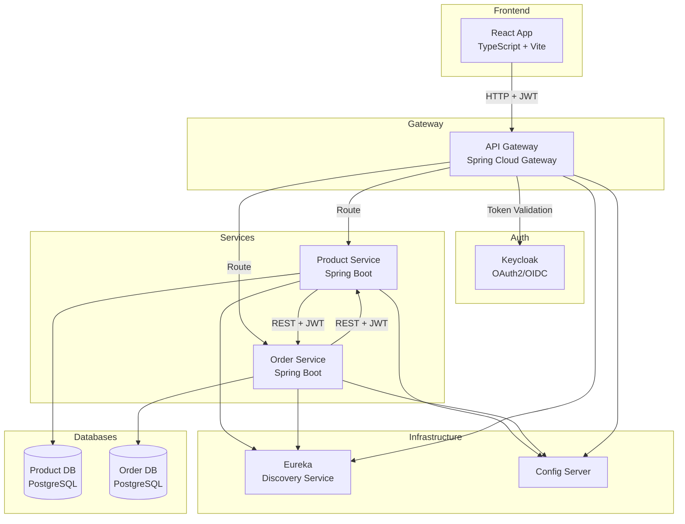
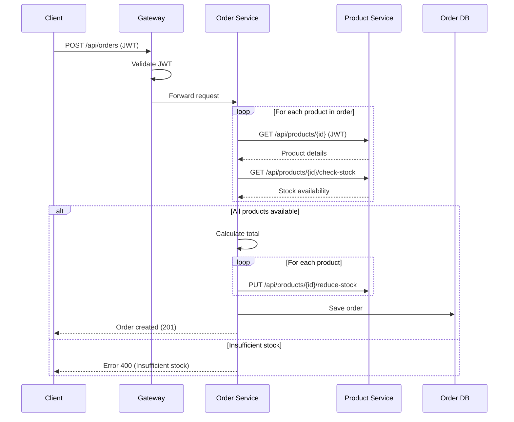

# Secure E-commerce Microservices - Implementation Plan

> **Stack**: Spring Boot 3.5.9 | Spring Cloud 2025.0.1 | Keycloak | React 19+ (TypeScript) | PostgreSQL | Docker

---

## Table of Contents

1. [Project Overview](#1-project-overview)
2. [Current State Analysis](#2-current-state-analysis)
3. [Phase 1: Fix Version Inconsistencies & Dependencies](#phase-1-fix-version-inconsistencies--dependencies)
4. [Phase 2: Keycloak Configuration](#phase-2-keycloak-configuration)
5. [Phase 3: Product Service Implementation](#phase-3-product-service-implementation)
6. [Phase 4: Command (Order) Service Implementation](#phase-4-command-order-service-implementation)
7. [Phase 5: API Gateway Security & Routing](#phase-5-api-gateway-security--routing)
8. [Phase 6: Inter-Service Communication](#phase-6-inter-service-communication)
9. [Phase 7: Logging & Traceability](#phase-7-logging--traceability)
10. [Phase 8: Dockerization](#phase-8-dockerization)
11. [Phase 9: DevSecOps](#phase-9-devsecops)
12. [Phase 10: Bonus Features](#phase-10-bonus-features)
13. [Phase 11: React Frontend](#phase-11-react-frontend)

---

## 1. Project Overview

### Architecture Diagram



### Required Roles

| Role    | Permissions |
|---------|-------------|
| ADMIN   | All operations on Products + View all Orders |
| CLIENT  | View Products + Create/View own Orders |

---

## 2. Current State Analysis

### ✅ What Exists

| Component | Status | Location |
|-----------|--------|----------|
| Config Service | Basic structure | `backend/config-service/` |
| Discovery Service (Eureka) | Basic structure | `backend/discovery-service/` |
| Gateway Service | Basic structure + dynamic routing bean | `backend/gateway-service/` |
| Product Service | Shell (Application class only) | `backend/product-service/` |
| Command Service | Shell (Application class only) | `backend/command-service/` |
| Keycloak realm JSON | **EMPTY** | `backend/keycloak/ecommerce-realm.json` |

### ⚠️ Issues Found

| Issue | Location | Fix Required |
|-------|----------|--------------|
| Version mismatch: Config Service uses Spring Boot **4.0.1** | `config-service/pom.xml` | Downgrade to **3.5.9** |
| Spring Cloud version mismatch: Config Service uses **2025.1.0** | `config-service/pom.xml` | Use **2025.0.1** |
| HikariPool name typo in command-service config | `command-service.yaml` line 16 | Change `ProductServiceHikariPool` → `CommandServiceHikariPool` |
| No OAuth2/Keycloak security configuration | All services | Add `issuer-uri` and security config |
| No Dockerfiles | All services | Create Dockerfiles |
| No docker-compose.yaml | Root | Create orchestration file |

### 📁 Current File Structure

```
backend/
├── config-service/
│   ├── pom.xml (Spring Boot 4.0.1 ⚠️)
│   └── src/main/resources/
│       ├── application.yaml
│       └── configurations/
│           ├── application.yaml (shared config)
│           ├── gateway-service.yaml
│           ├── product-service.yaml
│           └── command-service.yaml
├── discovery-service/
│   ├── pom.xml (Spring Boot 3.5.9 ✅)
│   └── src/main/resources/application.yaml
├── gateway-service/
│   ├── pom.xml (Spring Boot 3.5.9 ✅)
│   └── src/main/java/.../GatewayServiceApplication.java
├── product-service/
│   ├── pom.xml (Spring Boot 3.5.9 ✅)
│   └── src/main/java/.../ProductServiceApplication.java
├── command-service/
│   ├── pom.xml (Spring Boot 3.5.9 ✅)
│   └── src/main/java/.../CommandServiceApplication.java
└── keycloak/
    └── ecommerce-realm.json (EMPTY)
```

---

## Phase 1: Fix Version Inconsistencies & Dependencies

### 1.1 Fix Config Service Version

**File**: `backend/config-service/pom.xml`

```xml
<!-- CHANGE -->
<parent>
    <groupId>org.springframework.boot</groupId>
    <artifactId>spring-boot-starter-parent</artifactId>
    <version>3.5.9</version>  <!-- Was 4.0.1 -->
</parent>

<properties>
    <spring-cloud.version>2025.0.1</spring-cloud.version>  <!-- Was 2025.1.0 -->
</properties>
```

### 1.2 Add Missing Dependencies

**Product Service & Command Service** - Add MapStruct for DTO mapping:

```xml
<dependency>
    <groupId>org.mapstruct</groupId>
    <artifactId>mapstruct</artifactId>
    <version>1.6.3</version>
</dependency>
<dependency>
    <groupId>org.mapstruct</groupId>
    <artifactId>mapstruct-processor</artifactId>
    <version>1.6.3</version>
    <scope>provided</scope>
</dependency>
```

Update annotation processor paths:

```xml
<annotationProcessorPaths>
    <path>
        <groupId>org.projectlombok</groupId>
        <artifactId>lombok</artifactId>
    </path>
    <path>
        <groupId>org.projectlombok</groupId>
        <artifactId>lombok-mapstruct-binding</artifactId>
        <version>0.2.0</version>
    </path>
    <path>
        <groupId>org.mapstruct</groupId>
        <artifactId>mapstruct-processor</artifactId>
        <version>1.6.3</version>
    </path>
</annotationProcessorPaths>
```

### 1.3 Fix Config Typo

**File**: `backend/config-service/src/main/resources/configurations/command-service.yaml`

```yaml
# Line 16: Change
pool-name: CommandServiceHikariPool  # Was ProductServiceHikariPool
```

### 1.4 Checklist

- [x] Fix config-service Spring Boot version (4.0.1 → 3.5.9)
- [x] Fix config-service Spring Cloud version (2025.1.0 → 2025.0.1)
- [x] Add MapStruct to product-service
- [x] Add MapStruct to command-service
- [x] Fix HikariPool name typo in command-service.yaml

---

## Phase 2: Keycloak Configuration

### 2.1 Create Keycloak Realm JSON

**File**: `backend/keycloak/ecommerce-realm.json`

This file configures:
- Realm: `ecommerce-realm`
- Clients:
  - `ecommerce-gateway` (confidential client for API Gateway)
  - `ecommerce-frontend` (public client for React app)
- Roles: `ADMIN`, `CLIENT`
- Test Users: `admin` / `client`

```json
{
  "realm": "ecommerce-realm",
  "enabled": true,
  "sslRequired": "external",
  "registrationAllowed": false,
  "loginWithEmailAllowed": true,
  "duplicateEmailsAllowed": false,
  "resetPasswordAllowed": true,
  "editUsernameAllowed": false,
  "bruteForceProtected": true,
  
  "roles": {
    "realm": [
      { "name": "ADMIN", "description": "Administrator role" },
      { "name": "CLIENT", "description": "Client role" }
    ]
  },
  
  "clients": [
    {
      "clientId": "ecommerce-gateway",
      "name": "E-commerce API Gateway",
      "enabled": true,
      "clientAuthenticatorType": "client-secret",
      "secret": "gateway-secret-key",
      "publicClient": false,
      "bearerOnly": false,
      "standardFlowEnabled": true,
      "implicitFlowEnabled": false,
      "directAccessGrantsEnabled": true,
      "serviceAccountsEnabled": true,
      "redirectUris": ["http://localhost:8888/*"],
      "webOrigins": ["http://localhost:8888"],
      "protocol": "openid-connect",
      "attributes": {
        "access.token.lifespan": "300"
      },
      "protocolMappers": [
        {
          "name": "realm roles",
          "protocol": "openid-connect",
          "protocolMapper": "oidc-usermodel-realm-role-mapper",
          "consentRequired": false,
          "config": {
            "claim.name": "realm_access.roles",
            "jsonType.label": "String",
            "multivalued": "true",
            "id.token.claim": "true",
            "access.token.claim": "true",
            "userinfo.token.claim": "true"
          }
        }
      ]
    },
    {
      "clientId": "ecommerce-frontend",
      "name": "E-commerce React Frontend",
      "enabled": true,
      "publicClient": true,
      "standardFlowEnabled": true,
      "implicitFlowEnabled": false,
      "directAccessGrantsEnabled": true,
      "redirectUris": [
        "http://localhost:5173/*",
        "http://localhost:3000/*"
      ],
      "webOrigins": [
        "http://localhost:5173",
        "http://localhost:3000"
      ],
      "protocol": "openid-connect",
      "attributes": {
        "pkce.code.challenge.method": "S256"
      }
    }
  ],
  
  "users": [
    {
      "username": "admin",
      "enabled": true,
      "email": "admin@ecommerce.com",
      "firstName": "Admin",
      "lastName": "User",
      "emailVerified": true,
      "credentials": [
        {
          "type": "password",
          "value": "admin123",
          "temporary": false
        }
      ],
      "realmRoles": ["ADMIN", "CLIENT"]
    },
    {
      "username": "client",
      "enabled": true,
      "email": "client@ecommerce.com",
      "firstName": "Client",
      "lastName": "User",
      "emailVerified": true,
      "credentials": [
        {
          "type": "password",
          "value": "client123",
          "temporary": false
        }
      ],
      "realmRoles": ["CLIENT"]
    }
  ],
  
  "accessTokenLifespan": 300,
  "ssoSessionIdleTimeout": 1800,
  "ssoSessionMaxLifespan": 36000
}
```

### 2.2 Keycloak Configuration in Centralized Config

**File**: `backend/config-service/src/main/resources/configurations/application.yaml`

Add Keycloak configuration to shared config:

```yaml
# Add to existing application.yaml
spring:
  security:
    oauth2:
      resourceserver:
        jwt:
          issuer-uri: http://${KEYCLOAK_HOST:localhost}:${KEYCLOAK_PORT:8080}/realms/ecommerce-realm
          jwk-set-uri: http://${KEYCLOAK_HOST:localhost}:${KEYCLOAK_PORT:8080}/realms/ecommerce-realm/protocol/openid-connect/certs
```

### 2.3 Checklist

- [x] Create complete Keycloak realm JSON with roles, clients, users
- [x] Add JWT issuer-uri to shared config
- [ ] Test Keycloak realm import with Docker

---

## Phase 3: Product Service Implementation

### 3.1 Package Structure

```
product-service/src/main/java/ma/enset/productservice/
├── ProductServiceApplication.java
├── config/
│   └── SecurityConfig.java
├── entity/
│   └── Product.java
├── dto/
│   ├── ProductRequestDTO.java
│   └── ProductResponseDTO.java
├── mapper/
│   └── ProductMapper.java
├── repository/
│   └── ProductRepository.java
├── service/
│   ├── ProductService.java
│   └── ProductServiceImpl.java
├── controller/
│   └── ProductController.java
└── exception/
    ├── GlobalExceptionHandler.java
    ├── ProductNotFoundException.java
    └── InsufficientStockException.java
```

### 3.2 Entity - Product

**File**: `entity/Product.java`

```java
@Entity
@Table(name = "products")
@Data @NoArgsConstructor @AllArgsConstructor @Builder
public class Product {
    @Id
    @GeneratedValue(strategy = GenerationType.UUID)
    private String id;
    
    @NotBlank
    private String name;
    
    private String description;
    
    @NotNull @Positive
    private BigDecimal price;
    
    @NotNull @PositiveOrZero
    private Integer stockQuantity;
    
    @CreationTimestamp
    private LocalDateTime createdAt;
    
    @UpdateTimestamp
    private LocalDateTime updatedAt;
}
```

### 3.3 DTOs

**File**: `dto/ProductRequestDTO.java`

```java
public record ProductRequestDTO(
    @NotBlank String name,
    String description,
    @NotNull @Positive BigDecimal price,
    @NotNull @PositiveOrZero Integer stockQuantity
) {}
```

**File**: `dto/ProductResponseDTO.java`

```java
public record ProductResponseDTO(
    String id,
    String name,
    String description,
    BigDecimal price,
    Integer stockQuantity,
    LocalDateTime createdAt
) {}
```

### 3.4 Security Configuration

**File**: `config/SecurityConfig.java`

```java
@Configuration
@EnableWebSecurity
@EnableMethodSecurity
public class SecurityConfig {
    
    @Bean
    public SecurityFilterChain securityFilterChain(HttpSecurity http) throws Exception {
        return http
            .csrf(AbstractHttpConfigurer::disable)
            .authorizeHttpRequests(auth -> auth
                .requestMatchers("/actuator/**", "/v3/api-docs/**", "/swagger-ui/**").permitAll()
                .requestMatchers(HttpMethod.GET, "/api/products/**").hasAnyRole("ADMIN", "CLIENT")
                .requestMatchers(HttpMethod.POST, "/api/products/**").hasRole("ADMIN")
                .requestMatchers(HttpMethod.PUT, "/api/products/**").hasRole("ADMIN")
                .requestMatchers(HttpMethod.DELETE, "/api/products/**").hasRole("ADMIN")
                .anyRequest().authenticated()
            )
            .oauth2ResourceServer(oauth2 -> oauth2
                .jwt(jwt -> jwt.jwtAuthenticationConverter(jwtAuthenticationConverter()))
            )
            .sessionManagement(session -> session
                .sessionCreationPolicy(SessionCreationPolicy.STATELESS)
            )
            .build();
    }
    
    @Bean
    public JwtAuthenticationConverter jwtAuthenticationConverter() {
        JwtGrantedAuthoritiesConverter converter = new JwtGrantedAuthoritiesConverter();
        converter.setAuthoritiesClaimName("realm_access.roles");
        converter.setAuthorityPrefix("ROLE_");
        
        JwtAuthenticationConverter jwtConverter = new JwtAuthenticationConverter();
        jwtConverter.setJwtGrantedAuthoritiesConverter(jwt -> {
            Collection<GrantedAuthority> authorities = new ArrayList<>();
            
            // Extract roles from realm_access.roles
            Map<String, Object> realmAccess = jwt.getClaim("realm_access");
            if (realmAccess != null) {
                List<String> roles = (List<String>) realmAccess.get("roles");
                if (roles != null) {
                    roles.forEach(role -> 
                        authorities.add(new SimpleGrantedAuthority("ROLE_" + role))
                    );
                }
            }
            return authorities;
        });
        return jwtConverter;
    }
}
```

### 3.5 Controller Endpoints

**File**: `controller/ProductController.java`

| Method | Endpoint | Role | Description |
|--------|----------|------|-------------|
| GET | `/api/products` | ADMIN, CLIENT | List all products |
| GET | `/api/products/{id}` | ADMIN, CLIENT | Get product by ID |
| POST | `/api/products` | ADMIN | Create product |
| PUT | `/api/products/{id}` | ADMIN | Update product |
| DELETE | `/api/products/{id}` | ADMIN | Delete product |
| GET | `/api/products/{id}/check-stock?quantity=X` | Internal | Check stock availability |
| PUT | `/api/products/{id}/reduce-stock?quantity=X` | Internal | Reduce stock after order |

### 3.6 Enable OpenFeign

**File**: `ProductServiceApplication.java`

```java
@SpringBootApplication
@EnableFeignClients
@EnableDiscoveryClient
public class ProductServiceApplication {
    public static void main(String[] args) {
        SpringApplication.run(ProductServiceApplication.class, args);
    }
}
```

### 3.7 Checklist

- [ ] Create Product entity with JPA annotations
- [ ] Create ProductRequestDTO and ProductResponseDTO records
- [ ] Create ProductMapper interface (MapStruct)
- [ ] Create ProductRepository
- [ ] Create ProductService interface and implementation
- [ ] Create ProductController with role-based endpoints
- [ ] Create SecurityConfig with JWT authentication
- [ ] Create custom exceptions (ProductNotFoundException, InsufficientStockException)
- [ ] Create GlobalExceptionHandler
- [ ] Add @EnableFeignClients and @EnableDiscoveryClient annotations
- [ ] Test all endpoints via Swagger

---

## Phase 4: Command (Order) Service Implementation

### 4.1 Package Structure

```
command-service/src/main/java/ma/enset/commandservice/
├── CommandServiceApplication.java
├── config/
│   ├── SecurityConfig.java
│   └── FeignConfig.java
├── entity/
│   ├── Order.java
│   └── OrderItem.java
├── enums/
│   └── OrderStatus.java
├── dto/
│   ├── OrderRequestDTO.java
│   ├── OrderResponseDTO.java
│   ├── OrderItemDTO.java
│   └── ProductDTO.java
├── mapper/
│   └── OrderMapper.java
├── repository/
│   └── OrderRepository.java
├── client/
│   └── ProductServiceClient.java
├── service/
│   ├── OrderService.java
│   └── OrderServiceImpl.java
├── controller/
│   └── OrderController.java
└── exception/
    ├── GlobalExceptionHandler.java
    ├── OrderNotFoundException.java
    ├── ProductNotAvailableException.java
    └── InsufficientStockException.java
```

### 4.2 Entities

**File**: `entity/Order.java`

```java
@Entity
@Table(name = "orders")
@Data @NoArgsConstructor @AllArgsConstructor @Builder
public class Order {
    @Id
    @GeneratedValue(strategy = GenerationType.UUID)
    private String id;
    
    @NotBlank
    private String userId;  // From JWT subject
    
    @NotBlank
    private String username;  // From JWT preferred_username
    
    @Enumerated(EnumType.STRING)
    private OrderStatus status;
    
    @NotNull
    private BigDecimal totalAmount;
    
    @OneToMany(mappedBy = "order", cascade = CascadeType.ALL, orphanRemoval = true)
    private List<OrderItem> items = new ArrayList<>();
    
    @CreationTimestamp
    private LocalDateTime orderDate;
    
    @UpdateTimestamp
    private LocalDateTime updatedAt;
}
```

**File**: `entity/OrderItem.java`

```java
@Entity
@Table(name = "order_items")
@Data @NoArgsConstructor @AllArgsConstructor @Builder
public class OrderItem {
    @Id
    @GeneratedValue(strategy = GenerationType.IDENTITY)
    private Long id;
    
    @ManyToOne(fetch = FetchType.LAZY)
    @JoinColumn(name = "order_id")
    private Order order;
    
    @NotBlank
    private String productId;
    
    private String productName;
    
    @NotNull @Positive
    private Integer quantity;
    
    @NotNull @Positive
    private BigDecimal unitPrice;
    
    @NotNull
    private BigDecimal subtotal;
}
```

### 4.3 Feign Client for Product Service

**File**: `client/ProductServiceClient.java`

```java
@FeignClient(name = "product-service", configuration = FeignConfig.class)
public interface ProductServiceClient {
    
    @GetMapping("/api/products/{id}")
    ProductDTO getProductById(@PathVariable String id);
    
    @GetMapping("/api/products/{id}/check-stock")
    boolean checkStock(@PathVariable String id, @RequestParam Integer quantity);
    
    @PutMapping("/api/products/{id}/reduce-stock")
    void reduceStock(@PathVariable String id, @RequestParam Integer quantity);
}
```

### 4.4 Feign Configuration (JWT Propagation)

**File**: `config/FeignConfig.java`

```java
@Configuration
public class FeignConfig {
    
    @Bean
    public RequestInterceptor requestInterceptor() {
        return requestTemplate -> {
            Authentication authentication = SecurityContextHolder.getContext().getAuthentication();
            if (authentication instanceof JwtAuthenticationToken jwtAuth) {
                String token = jwtAuth.getToken().getTokenValue();
                requestTemplate.header("Authorization", "Bearer " + token);
            }
        };
    }
}
```

### 4.5 Controller Endpoints

**File**: `controller/OrderController.java`

| Method | Endpoint | Role | Description |
|--------|----------|------|-------------|
| POST | `/api/orders` | CLIENT | Create new order |
| GET | `/api/orders/my-orders` | CLIENT | Get current user's orders |
| GET | `/api/orders/{id}` | CLIENT (owner) / ADMIN | Get order by ID |
| GET | `/api/orders` | ADMIN | List all orders |

### 4.6 Order Creation Flow



### 4.7 Checklist

- [ ] Create Order and OrderItem entities
- [ ] Create OrderStatus enum (PENDING, CONFIRMED, SHIPPED, DELIVERED, CANCELLED)
- [ ] Create DTOs (OrderRequestDTO, OrderResponseDTO, OrderItemDTO, ProductDTO)
- [ ] Create OrderMapper interface (MapStruct)
- [ ] Create OrderRepository
- [ ] Create ProductServiceClient (Feign)
- [ ] Create FeignConfig for JWT propagation
- [ ] Create OrderService with business logic:
  - [ ] Validate product availability
  - [ ] Calculate total amount
  - [ ] Create order with items
  - [ ] Reduce stock via Product Service
- [ ] Create OrderController with role-based endpoints
- [ ] Create SecurityConfig with JWT authentication
- [ ] Create custom exceptions
- [ ] Test inter-service communication

---

## Phase 5: API Gateway Security & Routing

### 5.1 Update Gateway Configuration

**File**: `backend/config-service/src/main/resources/configurations/gateway-service.yaml`

```yaml
spring:
  cloud:
    gateway:
      discovery:
        locator:
          enabled: true
          lower-case-service-id: true
      default-filters:
        - DedupeResponseHeader=Access-Control-Allow-Credentials Access-Control-Allow-Origin
      routes:
        - id: product-service
          uri: lb://product-service
          predicates:
            - Path=/api/products/**
          filters:
            - TokenRelay=
            
        - id: order-service
          uri: lb://command-service
          predicates:
            - Path=/api/orders/**
          filters:
            - TokenRelay=
            
  security:
    oauth2:
      client:
        registration:
          keycloak:
            client-id: ecommerce-gateway
            client-secret: gateway-secret-key
            scope: openid,profile,email
            authorization-grant-type: authorization_code
            redirect-uri: "{baseUrl}/login/oauth2/code/{registrationId}"
        provider:
          keycloak:
            issuer-uri: http://${KEYCLOAK_HOST:localhost}:${KEYCLOAK_PORT:8080}/realms/ecommerce-realm
            user-name-attribute: preferred_username
      resourceserver:
        jwt:
          issuer-uri: http://${KEYCLOAK_HOST:localhost}:${KEYCLOAK_PORT:8080}/realms/ecommerce-realm

# CORS Configuration
  webflux:
    cors:
      allowed-origins: "http://localhost:5173,http://localhost:3000"
      allowed-methods: "GET,POST,PUT,DELETE,OPTIONS"
      allowed-headers: "*"
      allow-credentials: true

springdoc:
  swagger-ui:
    urls:
      - name: Product Service
        url: /product-service/v3/api-docs
      - name: Order Service
        url: /command-service/v3/api-docs
    urls-primary-name: Product Service
```

### 5.2 Gateway Security Configuration

**File**: `backend/gateway-service/src/main/java/ma/enset/gatewayservice/config/SecurityConfig.java`

```java
@Configuration
@EnableWebFluxSecurity
public class SecurityConfig {
    
    @Bean
    public SecurityWebFilterChain securityWebFilterChain(ServerHttpSecurity http) {
        return http
            .csrf(ServerHttpSecurity.CsrfSpec::disable)
            .cors(Customizer.withDefaults())
            .authorizeExchange(exchange -> exchange
                .pathMatchers("/actuator/**").permitAll()
                .pathMatchers("/swagger-ui/**", "/v3/api-docs/**").permitAll()
                .pathMatchers("/webjars/**").permitAll()
                .anyExchange().authenticated()
            )
            .oauth2ResourceServer(oauth2 -> oauth2
                .jwt(Customizer.withDefaults())
            )
            .build();
    }
}
```

### 5.3 CORS Configuration

**File**: `backend/gateway-service/src/main/java/ma/enset/gatewayservice/config/CorsConfig.java`

```java
@Configuration
public class CorsConfig {
    
    @Bean
    public CorsWebFilter corsWebFilter() {
        CorsConfiguration config = new CorsConfiguration();
        config.setAllowedOrigins(List.of("http://localhost:5173", "http://localhost:3000"));
        config.setAllowedMethods(List.of("GET", "POST", "PUT", "DELETE", "OPTIONS"));
        config.setAllowedHeaders(List.of("*"));
        config.setAllowCredentials(true);
        config.setMaxAge(3600L);
        
        UrlBasedCorsConfigurationSource source = new UrlBasedCorsConfigurationSource();
        source.registerCorsConfiguration("/**", config);
        
        return new CorsWebFilter(source);
    }
}
```

### 5.4 Checklist

- [ ] Update gateway-service.yaml with explicit routes
- [ ] Add TokenRelay filter for JWT propagation
- [ ] Create SecurityConfig for gateway (WebFlux)
- [ ] Create CorsConfig for frontend access
- [ ] Configure OAuth2 client for Keycloak
- [ ] Test routing and JWT validation
- [ ] Verify Swagger UI aggregation works

---

## Phase 6: Inter-Service Communication

### 6.1 JWT Token Propagation

For Feign clients to propagate JWT tokens to downstream services:

1. **FeignConfig** (already defined in Phase 4.4)
2. **Request Interceptor** extracts token from SecurityContext
3. **Adds Authorization header** to outgoing requests

### 6.2 Error Handling for Service Communication

**File**: `command-service/.../exception/FeignErrorDecoder.java`

```java
@Component
public class FeignErrorDecoder implements ErrorDecoder {
    
    @Override
    public Exception decode(String methodKey, Response response) {
        return switch (response.status()) {
            case 404 -> new ProductNotAvailableException("Product not found");
            case 400 -> new InsufficientStockException("Insufficient stock for product");
            case 401, 403 -> new AccessDeniedException("Unauthorized access to product service");
            default -> new RuntimeException("Unknown error from product service");
        };
    }
}
```

### 6.3 Checklist

- [ ] Implement FeignConfig with RequestInterceptor
- [ ] Create FeignErrorDecoder for error handling
- [ ] Test token propagation between services
- [ ] Verify error handling works correctly

---

## Phase 7: Logging & Traceability

### 7.1 Logback Configuration

**File**: `backend/config-service/src/main/resources/configurations/application.yaml` (add to shared config)

```yaml
logging:
  level:
    root: INFO
    ma.enset: DEBUG
    org.springframework.security: DEBUG
  pattern:
    console: "%d{yyyy-MM-dd HH:mm:ss} [%thread] %-5level %logger{36} [user:%X{userId}] - %msg%n"
```

### 7.2 MDC Filter for User Identification

**File**: Create in each service `config/MdcFilter.java`

```java
@Component
public class MdcFilter extends OncePerRequestFilter {
    
    @Override
    protected void doFilterInternal(HttpServletRequest request, 
                                    HttpServletResponse response, 
                                    FilterChain filterChain) throws ServletException, IOException {
        try {
            Authentication auth = SecurityContextHolder.getContext().getAuthentication();
            if (auth instanceof JwtAuthenticationToken jwtAuth) {
                MDC.put("userId", jwtAuth.getToken().getSubject());
                MDC.put("username", jwtAuth.getToken().getClaimAsString("preferred_username"));
            }
            filterChain.doFilter(request, response);
        } finally {
            MDC.clear();
        }
    }
}
```

### 7.3 Request/Response Logging

**File**: Each service `config/LoggingInterceptor.java`

```java
@Slf4j
@Component
public class LoggingInterceptor implements HandlerInterceptor {
    
    @Override
    public boolean preHandle(HttpServletRequest request, HttpServletResponse response, Object handler) {
        log.info("Incoming request: {} {} from {}", 
            request.getMethod(), 
            request.getRequestURI(), 
            request.getRemoteAddr());
        return true;
    }
    
    @Override
    public void afterCompletion(HttpServletRequest request, HttpServletResponse response, 
                                Object handler, Exception ex) {
        log.info("Request completed: {} {} - Status: {}", 
            request.getMethod(), 
            request.getRequestURI(), 
            response.getStatus());
    }
}
```

### 7.4 Actuator Health Endpoints

Already configured in shared `application.yaml`. Ensure all endpoints exposed:

```yaml
management:
  endpoints:
    web:
      exposure:
        include: health,info,metrics,loggers
  endpoint:
    health:
      show-details: when_authorized
```

### 7.5 Checklist

- [ ] Configure Logback with user identification pattern
- [ ] Create MdcFilter in each service
- [ ] Create LoggingInterceptor for request/response logging
- [ ] Configure Actuator endpoints
- [ ] Test logging with user identification

---

## Phase 8: Dockerization

### 8.1 Dockerfile for Spring Boot Services

**Template for all Spring Boot services**:

**File**: `backend/{service-name}/Dockerfile`

```dockerfile
# Build stage
FROM eclipse-temurin:21-jdk-alpine AS builder
WORKDIR /app
COPY .mvn/ .mvn
COPY mvnw pom.xml ./
RUN chmod +x mvnw && ./mvnw dependency:go-offline
COPY src ./src
RUN ./mvnw package -DskipTests

# Runtime stage
FROM eclipse-temurin:21-jre-alpine
WORKDIR /app
COPY --from=builder /app/target/*.jar app.jar
EXPOSE ${PORT:-8080}
ENTRYPOINT ["java", "-jar", "app.jar"]
```

### 8.2 Docker Compose

**File**: `docker-compose.yaml` (project root)

```yaml
version: '3.8'

services:
  # PostgreSQL for Product Service
  product-db:
    image: postgres:16-alpine
    container_name: product-db
    environment:
      POSTGRES_DB: product_db
      POSTGRES_USER: product_user
      POSTGRES_PASSWORD: product_pass
    volumes:
      - product_data:/var/lib/postgresql/data
    networks:
      - ecommerce-network
    healthcheck:
      test: ["CMD-SHELL", "pg_isready -U product_user -d product_db"]
      interval: 10s
      timeout: 5s
      retries: 5

  # PostgreSQL for Order Service
  order-db:
    image: postgres:16-alpine
    container_name: order-db
    environment:
      POSTGRES_DB: command_db
      POSTGRES_USER: order_user
      POSTGRES_PASSWORD: order_pass
    volumes:
      - order_data:/var/lib/postgresql/data
    networks:
      - ecommerce-network
    healthcheck:
      test: ["CMD-SHELL", "pg_isready -U order_user -d command_db"]
      interval: 10s
      timeout: 5s
      retries: 5

  # Keycloak
  keycloak:
    image: quay.io/keycloak/keycloak:26.0
    container_name: keycloak
    environment:
      KC_BOOTSTRAP_ADMIN_USERNAME: admin
      KC_BOOTSTRAP_ADMIN_PASSWORD: admin
      KC_DB: dev-file
    command: start-dev --import-realm
    volumes:
      - ./backend/keycloak/ecommerce-realm.json:/opt/keycloak/data/import/ecommerce-realm.json:ro
    ports:
      - "8080:8080"
    networks:
      - ecommerce-network
    healthcheck:
      test: ["CMD-SHELL", "exec 3<>/dev/tcp/localhost/8080 && echo -e 'GET /health HTTP/1.1\r\nHost: localhost\r\n\r\n' >&3 && cat <&3 | grep -q '200 OK'"]
      interval: 30s
      timeout: 10s
      retries: 5

  # Discovery Service (Eureka)
  discovery-service:
    build: ./backend/discovery-service
    container_name: discovery-service
    ports:
      - "8761:8761"
    networks:
      - ecommerce-network
    healthcheck:
      test: ["CMD", "wget", "-q", "--spider", "http://localhost:8761/actuator/health"]
      interval: 30s
      timeout: 10s
      retries: 5

  # Config Service
  config-service:
    build: ./backend/config-service
    container_name: config-service
    ports:
      - "9999:9999"
    environment:
      - EUREKA_HOST=discovery-service
    depends_on:
      discovery-service:
        condition: service_healthy
    networks:
      - ecommerce-network
    healthcheck:
      test: ["CMD", "wget", "-q", "--spider", "http://localhost:9999/actuator/health"]
      interval: 30s
      timeout: 10s
      retries: 5

  # Product Service
  product-service:
    build: ./backend/product-service
    container_name: product-service
    environment:
      - SPRING_CONFIG_IMPORT=optional:configserver:http://config-service:9999/
      - DB_HOST=product-db
      - DB_PORT=5432
      - DB_NAME=product_db
      - DB_USERNAME=product_user
      - DB_PASSWORD=product_pass
      - KEYCLOAK_HOST=keycloak
      - KEYCLOAK_PORT=8080
    depends_on:
      config-service:
        condition: service_healthy
      product-db:
        condition: service_healthy
      keycloak:
        condition: service_healthy
    networks:
      - ecommerce-network

  # Order Service
  command-service:
    build: ./backend/command-service
    container_name: command-service
    environment:
      - SPRING_CONFIG_IMPORT=optional:configserver:http://config-service:9999/
      - DB_HOST=order-db
      - DB_PORT=5432
      - DB_NAME=command_db
      - DB_USERNAME=order_user
      - DB_PASSWORD=order_pass
      - KEYCLOAK_HOST=keycloak
      - KEYCLOAK_PORT=8080
    depends_on:
      config-service:
        condition: service_healthy
      order-db:
        condition: service_healthy
      keycloak:
        condition: service_healthy
    networks:
      - ecommerce-network

  # API Gateway
  gateway-service:
    build: ./backend/gateway-service
    container_name: gateway-service
    ports:
      - "8888:8888"
    environment:
      - SPRING_CONFIG_IMPORT=optional:configserver:http://config-service:9999/
      - KEYCLOAK_HOST=keycloak
      - KEYCLOAK_PORT=8080
    depends_on:
      config-service:
        condition: service_healthy
      keycloak:
        condition: service_healthy
    networks:
      - ecommerce-network

networks:
  ecommerce-network:
    driver: bridge

volumes:
  product_data:
  order_data:
```

### 8.3 Checklist

- [ ] Create Dockerfile for config-service
- [ ] Create Dockerfile for discovery-service
- [ ] Create Dockerfile for gateway-service
- [ ] Create Dockerfile for product-service
- [ ] Create Dockerfile for command-service
- [ ] Create docker-compose.yaml with all services
- [ ] Test full stack with `docker-compose up --build`
- [ ] Verify service discovery works in Docker network
- [ ] Test Keycloak realm import on startup

---

## Phase 9: DevSecOps

### 9.1 SonarQube - Static Code Analysis

**File**: `sonar-project.properties` (project root)

```properties
sonar.projectKey=secure-ecommerce-microservices
sonar.projectName=Secure E-commerce Microservices
sonar.projectVersion=1.0

sonar.sources=backend
sonar.java.binaries=backend/**/target/classes
sonar.exclusions=**/test/**

sonar.host.url=http://localhost:9000
sonar.token=${SONAR_TOKEN}
```

Add to docker-compose:

```yaml
  sonarqube:
    image: sonarqube:lts-community
    container_name: sonarqube
    ports:
      - "9000:9000"
    environment:
      - SONAR_ES_BOOTSTRAP_CHECKS_DISABLE=true
    volumes:
      - sonar_data:/opt/sonarqube/data
      - sonar_extensions:/opt/sonarqube/extensions
      - sonar_logs:/opt/sonarqube/logs
    networks:
      - ecommerce-network
```

### 9.2 OWASP Dependency-Check

Add Maven plugin to each service `pom.xml`:

```xml
<plugin>
    <groupId>org.owasp</groupId>
    <artifactId>dependency-check-maven</artifactId>
    <version>10.0.4</version>
    <configuration>
        <failBuildOnCVSS>7</failBuildOnCVSS>
        <formats>
            <format>HTML</format>
            <format>JSON</format>
        </formats>
    </configuration>
    <executions>
        <execution>
            <goals>
                <goal>check</goal>
            </goals>
        </execution>
    </executions>
</plugin>
```

Run with:
```bash
./mvnw dependency-check:check
```

### 9.3 Trivy - Docker Image Scanning

Install Trivy and scan images:

```bash
# Install Trivy
curl -sfL https://raw.githubusercontent.com/aquasecurity/trivy/main/contrib/install.sh | sh -s -- -b /usr/local/bin

# Scan images
trivy image product-service:latest --severity HIGH,CRITICAL --format json --output trivy-product.json
trivy image command-service:latest --severity HIGH,CRITICAL --format json --output trivy-command.json
trivy image gateway-service:latest --severity HIGH,CRITICAL --format json --output trivy-gateway.json
```

### 9.4 GitHub Actions CI/CD Pipeline

**File**: `.github/workflows/ci.yml`

```yaml
name: CI/CD Pipeline

on:
  push:
    branches: [main, develop]
  pull_request:
    branches: [main]

jobs:
  build-and-test:
    runs-on: ubuntu-latest
    steps:
      - uses: actions/checkout@v4
      
      - name: Set up JDK 21
        uses: actions/setup-java@v4
        with:
          java-version: '21'
          distribution: 'temurin'
          
      - name: Build all services
        run: |
          cd backend
          for service in config-service discovery-service gateway-service product-service command-service; do
            echo "Building $service..."
            cd $service
            ./mvnw clean package -DskipTests
            cd ..
          done

  dependency-check:
    runs-on: ubuntu-latest
    needs: build-and-test
    steps:
      - uses: actions/checkout@v4
      - name: Run OWASP Dependency Check
        run: |
          cd backend/product-service
          ./mvnw dependency-check:check
          
  sonar-analysis:
    runs-on: ubuntu-latest
    needs: build-and-test
    steps:
      - uses: actions/checkout@v4
      - name: SonarQube Scan
        env:
          SONAR_TOKEN: ${{ secrets.SONAR_TOKEN }}
        run: |
          cd backend/product-service
          ./mvnw sonar:sonar
          
  docker-build-scan:
    runs-on: ubuntu-latest
    needs: [dependency-check]
    steps:
      - uses: actions/checkout@v4
      
      - name: Build Docker images
        run: |
          docker build -t product-service:latest ./backend/product-service
          docker build -t command-service:latest ./backend/command-service
          
      - name: Trivy scan
        uses: aquasecurity/trivy-action@master
        with:
          image-ref: 'product-service:latest'
          format: 'sarif'
          output: 'trivy-results.sarif'
```

### 9.5 Checklist

- [ ] Add OWASP Dependency-Check plugin to all services
- [ ] Create sonar-project.properties
- [ ] Add SonarQube to docker-compose
- [ ] Create GitHub Actions workflow
- [ ] Run initial security scans
- [ ] Document and fix any critical vulnerabilities
- [ ] Take screenshots of security tool outputs

---

## Phase 10: Bonus Features

### 10.1 Circuit Breaker (Resilience4j)

Already in pom.xml dependencies. Add configuration:

**File**: Centralized config for product-service and command-service

```yaml
resilience4j:
  circuitbreaker:
    instances:
      productService:
        registerHealthIndicator: true
        slidingWindowSize: 10
        permittedNumberOfCallsInHalfOpenState: 3
        slidingWindowType: COUNT_BASED
        minimumNumberOfCalls: 5
        waitDurationInOpenState: 10s
        failureRateThreshold: 50
        eventConsumerBufferSize: 10
        
  retry:
    instances:
      productService:
        maxAttempts: 3
        waitDuration: 1s
        
  timelimiter:
    instances:
      productService:
        timeoutDuration: 3s
```

Usage in OrderService:

```java
@CircuitBreaker(name = "productService", fallbackMethod = "getProductFallback")
@Retry(name = "productService")
public ProductDTO getProduct(String productId) {
    return productServiceClient.getProductById(productId);
}

public ProductDTO getProductFallback(String productId, Throwable t) {
    log.warn("Fallback for product {} due to: {}", productId, t.getMessage());
    throw new ProductServiceUnavailableException("Product service is temporarily unavailable");
}
```

### 10.2 Kubernetes Deployment (Optional)

Create K8s manifests in `kubernetes/` directory:
- Deployment files for each service
- Service files for internal communication
- Ingress for external access
- ConfigMaps and Secrets

### 10.3 Automated Tests

Add integration tests with Testcontainers:

```xml
<dependency>
    <groupId>org.testcontainers</groupId>
    <artifactId>postgresql</artifactId>
    <scope>test</scope>
</dependency>
<dependency>
    <groupId>org.testcontainers</groupId>
    <artifactId>junit-jupiter</artifactId>
    <scope>test</scope>
</dependency>
```

### 10.4 Checklist

- [ ] Configure Resilience4j Circuit Breaker
- [ ] Add fallback methods
- [ ] (Optional) Create Kubernetes manifests
- [ ] (Optional) Set up mTLS between services
- [ ] (Optional) Add integration tests with Testcontainers
- [ ] (Optional) Set up monitoring with Prometheus/Grafana

---

## Phase 11: React Frontend

### 11.1 Project Setup

```bash
npx -y create-vite@latest frontend -- --template react-ts
cd frontend
npm install
```

### 11.2 Dependencies

```bash
# Auth
npm install keycloak-js @react-keycloak/web

# Routing
npm install react-router-dom

# HTTP Client
npm install axios

# State Management (optional)
npm install zustand
```

### 11.3 Project Structure

```
frontend/
├── src/
│   ├── main.tsx
│   ├── App.tsx
│   ├── index.css                 # Global styles (shadcn theme)
│   ├── config/
│   │   └── keycloak.ts           # Keycloak configuration
│   ├── api/
│   │   ├── axios.ts              # Axios instance with JWT
│   │   ├── products.ts
│   │   └── orders.ts
│   ├── hooks/
│   │   ├── useAuth.ts
│   │   ├── useProducts.ts
│   │   └── useOrders.ts
│   ├── components/
│   │   ├── common/
│   │   │   ├── Header.tsx
│   │   │   ├── Sidebar.tsx
│   │   │   ├── Button.tsx
│   │   │   ├── Card.tsx
│   │   │   ├── Input.tsx
│   │   │   ├── Modal.tsx
│   │   │   └── ThemeToggle.tsx
│   │   ├── products/
│   │   │   ├── ProductList.tsx
│   │   │   ├── ProductCard.tsx
│   │   │   └── ProductForm.tsx
│   │   └── orders/
│   │       ├── OrderList.tsx
│   │       ├── OrderDetails.tsx
│   │       └── CreateOrder.tsx
│   ├── pages/
│   │   ├── HomePage.tsx
│   │   ├── ProductsPage.tsx
│   │   ├── ProductDetailPage.tsx
│   │   ├── OrdersPage.tsx
│   │   └── UnauthorizedPage.tsx
│   ├── context/
│   │   └── ThemeContext.tsx
│   └── types/
│       ├── product.ts
│       └── order.ts
└── vite.config.ts
```

### 11.4 Styling (shadcn Black & White Theme)

**File**: `src/index.css`

```css
:root {
  /* Light mode */
  --background: 0 0% 100%;
  --foreground: 0 0% 3.9%;
  --card: 0 0% 100%;
  --card-foreground: 0 0% 3.9%;
  --popover: 0 0% 100%;
  --popover-foreground: 0 0% 3.9%;
  --primary: 0 0% 9%;
  --primary-foreground: 0 0% 98%;
  --secondary: 0 0% 96.1%;
  --secondary-foreground: 0 0% 9%;
  --muted: 0 0% 96.1%;
  --muted-foreground: 0 0% 45.1%;
  --accent: 0 0% 96.1%;
  --accent-foreground: 0 0% 9%;
  --destructive: 0 84.2% 60.2%;
  --destructive-foreground: 0 0% 98%;
  --border: 0 0% 89.8%;
  --input: 0 0% 89.8%;
  --ring: 0 0% 3.9%;
  --radius: 0.5rem;
}

.dark {
  --background: 0 0% 3.9%;
  --foreground: 0 0% 98%;
  --card: 0 0% 3.9%;
  --card-foreground: 0 0% 98%;
  --popover: 0 0% 3.9%;
  --popover-foreground: 0 0% 98%;
  --primary: 0 0% 98%;
  --primary-foreground: 0 0% 9%;
  --secondary: 0 0% 14.9%;
  --secondary-foreground: 0 0% 98%;
  --muted: 0 0% 14.9%;
  --muted-foreground: 0 0% 63.9%;
  --accent: 0 0% 14.9%;
  --accent-foreground: 0 0% 98%;
  --destructive: 0 62.8% 30.6%;
  --destructive-foreground: 0 0% 98%;
  --border: 0 0% 14.9%;
  --input: 0 0% 14.9%;
  --ring: 0 0% 83.1%;
}

* {
  margin: 0;
  padding: 0;
  box-sizing: border-box;
}

body {
  font-family: 'Inter', system-ui, -apple-system, sans-serif;
  background-color: hsl(var(--background));
  color: hsl(var(--foreground));
  line-height: 1.5;
  transition: background-color 0.3s, color 0.3s;
}

/* Component styles following shadcn patterns */
.btn {
  display: inline-flex;
  align-items: center;
  justify-content: center;
  border-radius: var(--radius);
  font-size: 0.875rem;
  font-weight: 500;
  padding: 0.5rem 1rem;
  transition: all 0.2s;
  cursor: pointer;
  border: none;
}

.btn-primary {
  background-color: hsl(var(--primary));
  color: hsl(var(--primary-foreground));
}

.btn-primary:hover {
  opacity: 0.9;
}

.card {
  background-color: hsl(var(--card));
  border: 1px solid hsl(var(--border));
  border-radius: var(--radius);
  padding: 1.5rem;
}

.input {
  width: 100%;
  padding: 0.5rem 0.75rem;
  border: 1px solid hsl(var(--input));
  border-radius: var(--radius);
  background-color: transparent;
  font-size: 0.875rem;
}

.input:focus {
  outline: none;
  border-color: hsl(var(--ring));
  box-shadow: 0 0 0 2px hsl(var(--ring) / 0.2);
}
```

### 11.5 Keycloak Integration

**File**: `src/config/keycloak.ts`

```typescript
import Keycloak from 'keycloak-js';

const keycloak = new Keycloak({
  url: 'http://localhost:8080',
  realm: 'ecommerce-realm',
  clientId: 'ecommerce-frontend',
});

export default keycloak;
```

### 11.6 API Configuration with JWT

**File**: `src/api/axios.ts`

```typescript
import axios from 'axios';
import keycloak from '../config/keycloak';

const api = axios.create({
  baseURL: 'http://localhost:8888/api',
});

api.interceptors.request.use(
  (config) => {
    if (keycloak.token) {
      config.headers.Authorization = `Bearer ${keycloak.token}`;
    }
    return config;
  },
  (error) => Promise.reject(error)
);

api.interceptors.response.use(
  (response) => response,
  (error) => {
    if (error.response?.status === 401) {
      keycloak.login();
    } else if (error.response?.status === 403) {
      window.location.href = '/unauthorized';
    }
    return Promise.reject(error);
  }
);

export default api;
```

### 11.7 Features to Implement

| Page | Components | Role Access |
|------|------------|-------------|
| Home | Product catalog grid | All (public) |
| Products (Admin) | CRUD table, forms | ADMIN |
| Product Detail | Product info, add to cart | ADMIN, CLIENT |
| My Orders | Order list, order details | CLIENT |
| All Orders | All orders table | ADMIN |
| Create Order | Cart, checkout form | CLIENT |

### 11.8 Checklist

- [ ] Create Vite + React + TypeScript project
- [ ] Install dependencies (keycloak-js, axios, react-router-dom)
- [ ] Set up shadcn-inspired CSS with dark mode
- [ ] Configure Keycloak client
- [ ] Create axios instance with JWT interceptor
- [ ] Implement ThemeContext and ThemeToggle
- [ ] Create common components (Button, Card, Input, Modal)
- [ ] Create product components and pages
- [ ] Create order components and pages
- [ ] Implement role-based UI rendering
- [ ] Handle 401/403 errors gracefully
- [ ] Create Dockerfile for frontend
- [ ] Test full user flow

---

## Progress Tracking

| Phase | Status | Notes |
|-------|--------|-------|
| Phase 1: Fix Versions | ✅ Complete | |
| Phase 2: Keycloak | ✅ Complete | |
| Phase 3: Product Service | ⬜ Not Started | |
| Phase 4: Order Service | ⬜ Not Started | |
| Phase 5: API Gateway | ⬜ Not Started | |
| Phase 6: Inter-Service Comm | ⬜ Not Started | |
| Phase 7: Logging | ⬜ Not Started | |
| Phase 8: Docker | ⬜ Not Started | |
| Phase 9: DevSecOps | ⬜ Not Started | |
| Phase 10: Bonus | ⬜ Not Started | |
| Phase 11: React Frontend | ⬜ Not Started | |

---

## References

- [Spring Boot 3.5 Reference](https://docs.spring.io/spring-boot/3.5/reference/)
- [Spring Cloud Gateway Reference](https://docs.spring.io/spring-cloud-gateway/reference/)
- [Keycloak Documentation](https://www.keycloak.org/documentation)
- [React 19 Documentation](https://react.dev/)
- [Vite Documentation](https://vitejs.dev/)
- [OWASP Dependency-Check](https://owasp.org/www-project-dependency-check/)
- [Trivy Documentation](https://aquasecurity.github.io/trivy/)
